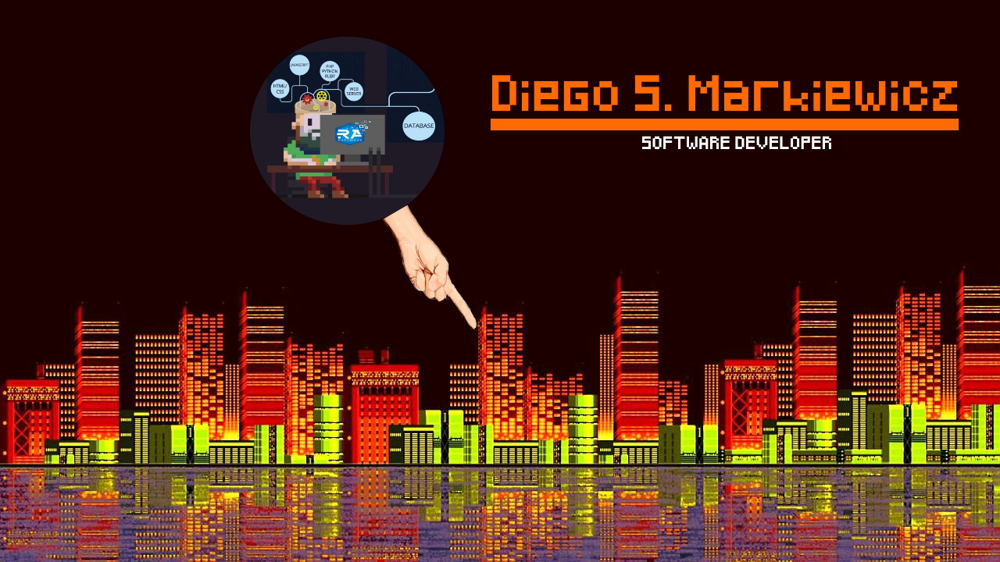

### Hola 👋 Mi nombre es Diego Markiewicz

- 🔭 Actualmente estoy desarrollando software para una empresa full time , tambien hago trabajos freelance.:boom:

## 🌐 Socials:
   

# 💻 Tech Stack:
                                
# 📊 GitHub Stats:
 
 

## 🏆 GitHub Trophies

### ✍️ Random Dev Quote

### 🔝 Top Contributed Repo

---

<!-- Proudly created with GPRM ( https://gprm.itsvg.in ) -->
